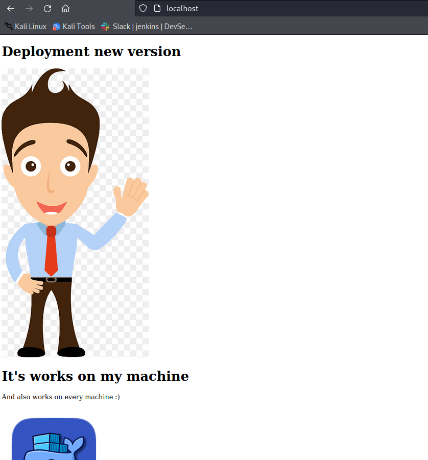
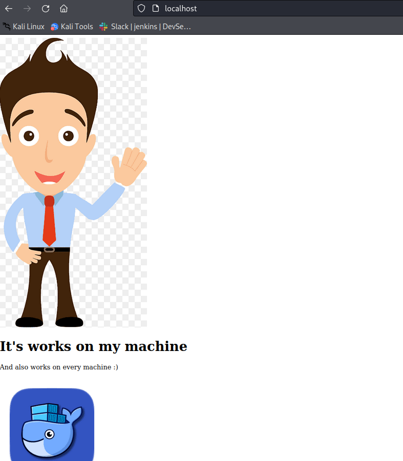
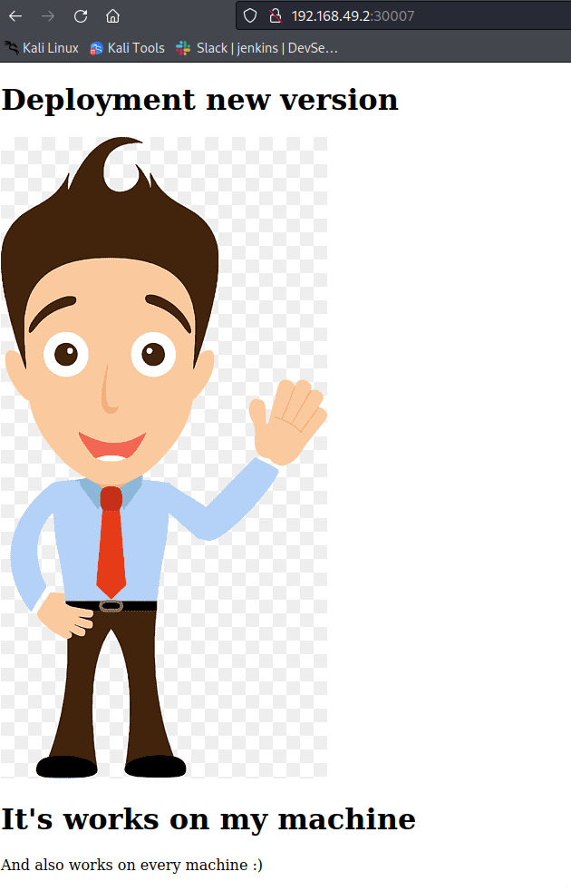

# Kubernetes
### Practice K8S

Create a pod: Imperative way
 - kubectl run first-pod --image=shadidevsecops/simple-api:1.0 --restart=Never

Logs inside pod:
 - kubectl logs "name-of-the-pod"

Delete pod:
 - kubectl delete pods "name-of-the-pod"
 
Expose port to listen ^ localhost:80
 - kubectl port-forward pods/"name-of-the-pod" 80

Get inside the pod: (-it: run terminal inside pod | i: input)
 - kubectl exec -it "name-of-the-pod" bash


--------------------------------------------------------------
### Create pod with Declarative way:

```
# that talked to the master
apiVersion: v1

# kind of this file
Kind: Pod

metadata:
   name: first-pod-dec
   lables:
      app: my-app
      type: rest-api

spec:
   containers: 
      - name: simple-pod
        image: shadidevsecops/simple-api:1.0
        
```

To create the pod declarative way: (-f: file yaml)
 - kubectl create -f pod-definition.yml
-----------------------------------------------------------------
### What is replicasets:
 - That ensures there is always a stable set of running pods for a specific workload

Selectors: 
- allows us to select Kubernetes resources based on the value of labels and resource fields assigned to a group of pods or nodes

```
apiVersion: apps/v1
kind: ReplicaSet
metadata:
   name: my-app-replicaset

spec:
   template:
      metadata:
         name: first-pod-dec-replicas
         labels:
            app: my-app
            type: rest-api

      spec:
         containers:
            - name: simple-api
              image: shadidevsecops/simple-api:1.0
    replicas: 3
   selector:
      matchLabels:
         app: my-app
         type: rest-api
```

Get the replicasets:
 - kubectl get replicasets
Delete the replicasets:
 - kubectl delete rs "name-of-the-replicaset"
---------------------------------------------------------------
### To see dashboard of the pods, cluster ... visualation.
 - minikube dashboard
----------------------------------------------------------------
### Scale UP/DOWN - Imperative way:
 - kubectl scale --replicas=6 replicaset "name-of-the-appReplicas"

Scale - Decleartive (change inside the code YAML file)
 - kubectl replace -f replica-def.yml
 
-----------------------------------------------------------------
### Deployment -

```
apiVersion: apps/v1
kind: ReplicaSet
metadata:
   name: my-app-replicaset

spec:
   template:
      metadata:
         name: first-pod-dec-replicas
         labels:
            app: my-app
            type: rest-api

      spec:
         containers:
            - name: simple-api
              image: shadidevsecops/simple-api:1.0
   replicas: 5
   selector:
      matchLabels:
         app: my-app
         type: rest-api
```

- Rolling update - one at the time : will change one pod not all the pods
- Rolling back - one at the time - when we found the new version have issue

 - Kubectl create -f "name-of-the-deplyment"
 - kubectl get deployments (To see the deployment)
 - kubectl describe deployments my-app-deployment (To Describe)
 - kubectl rollout history deployment/my-app-deployment (To see the changes I did. To can roll back to previous version)
 - kubectl create -f deployment-def.yml --record (To record the command when I type rollout)
 - kubectl apply -f deployment-def.yml (If I want to update the version to the new one)

 - kubectl rollout undo deployment/my-app-deployment --to-revision 1


---------------------------------------------------------------
How to edit code and push the new version to DockerHub:
 - Edit the code then build the image.
 - docker build -t simple-api .
 - docker tag simple-api shadidevsecops/simple-api:2.0
 - docker login
 - docker push shadidevsecops/simple-api:2.0

* Need to create a script for this step: to automated the process. This called CI/CD (DevOps responsibility)
----------------------------------------------------------------
### Services:
 - ClusterIP: Responsible the communication between the pods inside the K8S cluster.
 - NodePort: (External access) Accessible from the Internet - users can access.
NodePort: External IP.



Commands:
Give us more info etc.. IP.
 - kubectl get pods -o wide
To see the services I have
 - kubectl get svc
